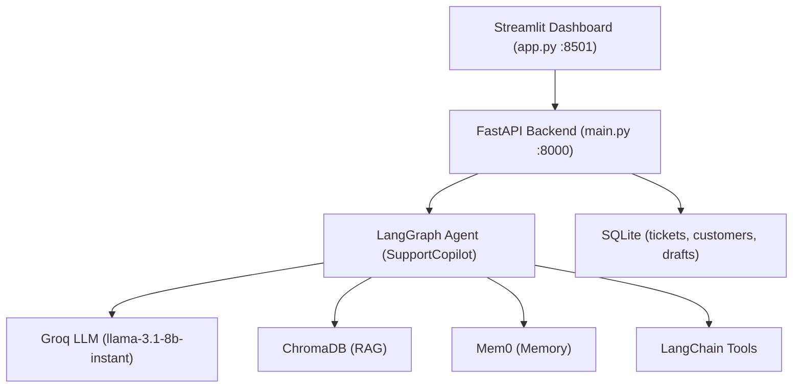

# Final Capstone Project Submission Document

## IIT Patna — Generative AI Capstone Sprint 2026 (Batch 4)

## 1. Project Title

**Customer Support Agent (Support Copilot)** — An AI-driven copilot that automatically generates draft resolutions for incoming customer support tickets using Retrieval-Augmented Generation, long-term memory, and tool-calling.

## 2. Submission Links

| Item | Link |
|---|---|
| Program (Notion) | https://app.notion.com/p/IIT-Patna-Generative-AI-Capstone-Sprint-2026-Batch-4-394c4d1f2688807dbaf4e471b5e3dbf4 |
| Final Submission Form | https://docs.google.com/forms/d/e/1FAIpQLScZYY4OCaURzhI8TepjAfM0rTmDQ_xI9Rbjj_G8gQSVajZUlA/viewform?pli=1 |
| GitHub Repository | https://github.com/2024aiml037-jpg/cutomer_support_agent_live |
| AWS Deployed UI (Streamlit) | http://13.211.160.77:8501/ |
| AWS Deployed API Docs (Swagger) | http://13.211.160.77:8000/docs#/ |

## 3. Problem Statement

Support agents spend significant time drafting responses and gathering context per ticket. The system reduces response time and improves consistency by retrieving past interactions, pulling relevant product/policy documentation, accessing live account data, and generating a structured draft reply for the agent to review.

## 4. Solution Overview

The application is a multi-layered system with a Streamlit dashboard, a FastAPI backend, and a LangChain/LangGraph ReAct agent orchestration layer. The `SupportCopilot` agent coordinates a Groq LLM, a mem0 long-term memory store, a ChromaDB RAG knowledge base, and LangChain tools to produce a structured draft.



## 5. Technology Stack

| Layer | Technology |
|---|---|
| LLM | Groq (llama-3.1-8b-instant) / Google Gemini |
| Agent framework | LangGraph + LangChain |
| Long-term memory | Mem0 + ChromaDB |
| Knowledge base (RAG) | ChromaDB |
| API | FastAPI + Uvicorn |
| UI | Streamlit |
| Database | SQLite |
| Containerisation | Docker / Docker Compose |

The project targets Python 3.11 (`requires-python = ">=3.11,<3.12"`) and manages dependencies with [uv](https://docs.astral.sh/uv/).

## 6. Key Features / Capabilities

- **Automated draft generation** — background task orchestration generates and stores a `StructuredDraftContext` per ticket.
- **RAG over knowledge base** — Markdown FAQ documents in `knowledge_base/` ingested into ChromaDB.
- **Long-term customer memory** via Mem0, including resolution memories for closed tickets.
- **Tool-calling for live data** — `lookup_customer_plan` (returns plan tier and SLA hours) and `lookup_open_ticket_load` (returns open ticket count and load band), registered via `get_support_tools()`.

## 7. API Endpoints

| Method | Path | Description |
|---|---|---|
| GET | `/health` | Health check |
| POST | `/api/tickets` | Create a support ticket |
| GET | `/api/tickets` | List all tickets |
| GET | `/api/tickets/{ticket_id}` | Get a single ticket |
| POST | `/api/tickets/{ticket_id}/generate-draft` | Generate an AI reply draft |
| GET | `/api/drafts/{ticket_id}` | Get the draft for a ticket |
| POST | `/api/knowledge/ingest` | Ingest knowledge-base documents |
| GET | `/api/customers/{customer_id}/memories` | Retrieve customer memories |
| GET | `/api/customers/{customer_id}/memory-search` | Search customer memories |

Interactive Swagger docs are available at the deployed endpoint http://13.211.160.77:8000/docs#/.

## 8. Deployment (AWS EC2)

The project is deployed on AWS EC2 via a GitHub Actions CI/CD pipeline defined in `.github/workflows/deploy-ec2.yml`, comprising a `test` job (runs `uv sync --dev` then `uv run pytest -q`) and a `deploy` job gated on tests passing. The deploy job packages the source as a tarball, transfers it to EC2 over `scp`, extracts it to `/opt/customer_support_agent`, prunes Docker cache, and runs `docker compose up -d --build`. A health-check loop polls `http://127.0.0.1:8000/health` for up to 60 seconds to confirm the API is live.

Live deployment:

- UI: http://13.211.160.77:8501/
- API Docs: http://13.211.160.77:8000/docs#/

## 9. How to Run Locally

```bash
git clone https://github.com/2024aiml037-jpg/cutomer_support_agent_live
cd cutomer_support_agent_live
cp .env.example .env    # add GROQ_API_KEY, etc.
uv sync
uv run python main.py                 # API on :8000
uv run streamlit run app.py           # UI on :8501
# or: docker compose up --build
```

Required environment variable: `GROQ_API_KEY`; optional: `GOOGLE_API_KEY`, `OPENAI_API_KEY`, `GROQ_MODEL`, `LLM_TEMPERATURE`, `ENABLE_LOCAL_EMBEDDINGS`, `API_HOST`, `API_PORT`.

## 10. Testing

Unit/integration tests run with `uv run pytest tests/`; end-to-end UI tests run against a live stack via `tests/e2e/test_dashboard_ui.py`.
