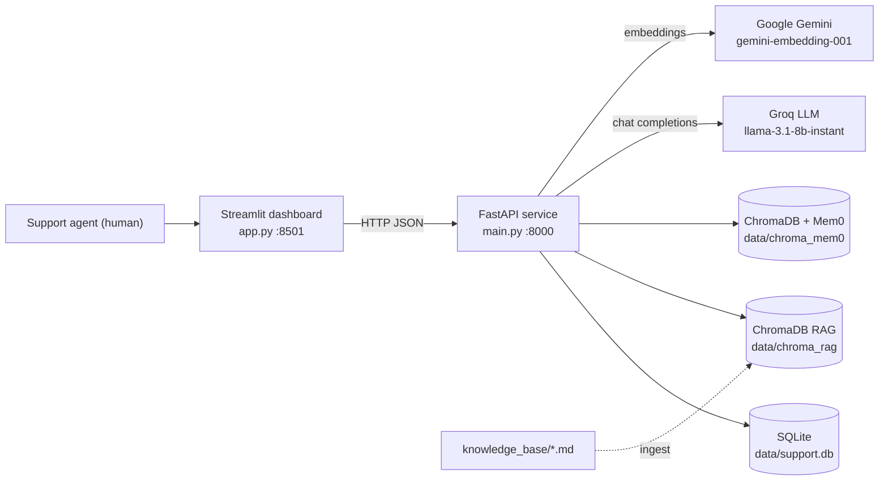
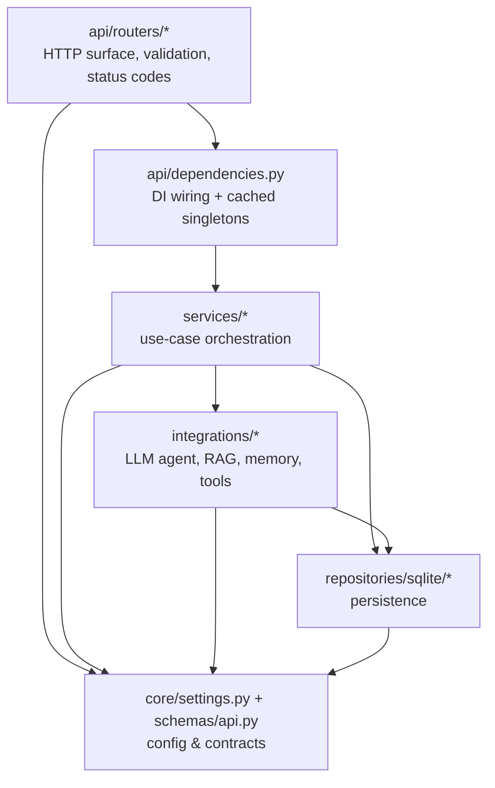
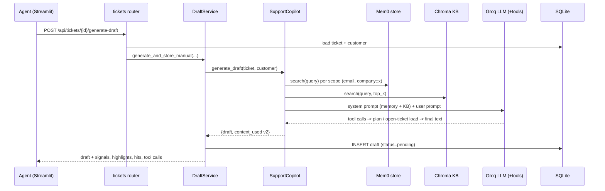
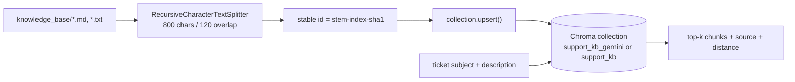
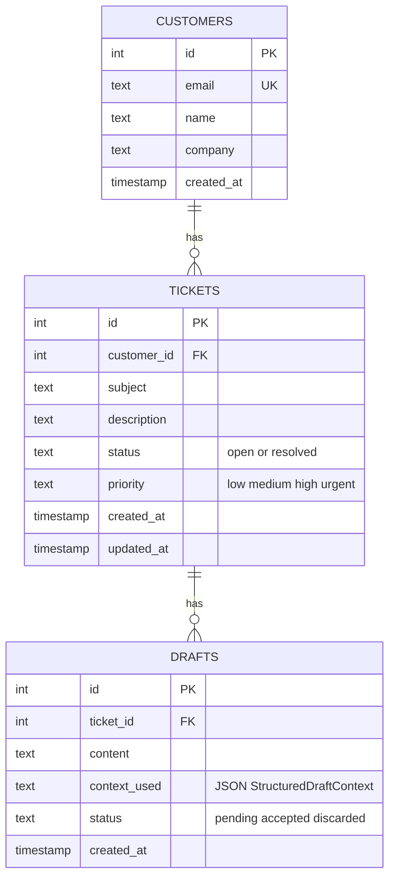
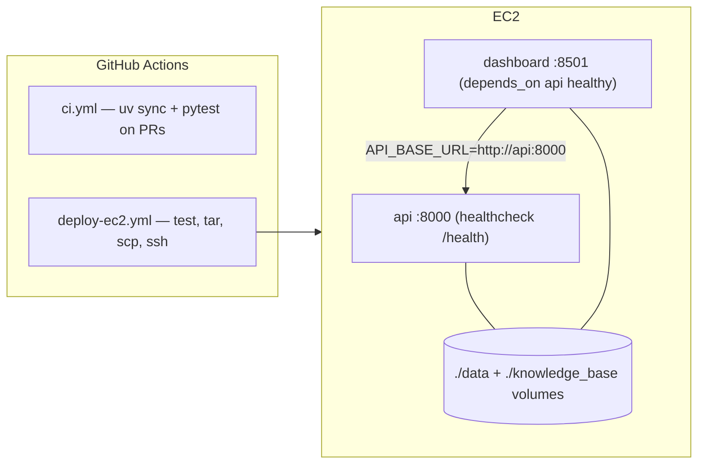

# Codebase Architecture — AI Copilot for Support Agents

A presentation-ready walkthrough of what this system does, how the code is
organised, and how a request flows end to end.

- **Product**: an AI copilot that drafts replies to customer support tickets for
  a human agent to review, edit, accept or discard.
- **Stack**: FastAPI (API) + Streamlit (agent dashboard) + LangChain/LangGraph
  agent on Groq + ChromaDB (RAG) + Mem0 (long-term customer memory) + SQLite
  (tickets/drafts), packaged with Docker Compose and deployed to EC2 via GitHub
  Actions.

---

## 1. System context



The dashboard is a pure HTTP client — it holds no business logic and talks only
to the API (`API_BASE_URL`, defaulting to `http://localhost:8000`).

---

## 2. Layered structure

The package follows a strict one-way dependency chain. Nothing lower ever
imports something higher.



| Layer | Directory | Responsibility |
| --- | --- | --- |
| Entrypoints | `main.py`, `app.py` | Uvicorn app object; Streamlit UI |
| App factory | `customer_support_agent/api/app_factory.py` | Builds `FastAPI`, mounts routers, lifespan creates dirs + tables |
| Routers | `customer_support_agent/api/routers/` | `health`, `tickets`, `drafts`, `knowledge`, `memory` |
| DI | `customer_support_agent/api/dependencies.py` | Repos/services per request, `@lru_cache` copilot, 503 when the copilot can't boot |
| Services | `customer_support_agent/services/` | `SupportCopilot` (agent), `DraftService`, `KnowledgeService` |
| Integrations | `customer_support_agent/integrations/` | `rag/chroma_kb.py`, `memory/mem0_store.py`, `tools/support_tools.py` |
| Repositories | `customer_support_agent/repositories/sqlite/` | `customers`, `tickets`, `drafts`, `base` (schema + connection) |
| Contracts | `customer_support_agent/schemas/api.py` | Pydantic request/response models |
| Config | `customer_support_agent/core/settings.py` | Env-driven `Settings`, path resolution, directory bootstrap |

---

## 3. Directory tree

```text
cutomer_support_agent_live/
├── main.py                      # uvicorn entrypoint -> create_app()
├── app.py                       # Streamlit agent dashboard
├── customer_support_agent/
│   ├── api/
│   │   ├── app_factory.py       # FastAPI assembly + lifespan (ensure_directories, init_db)
│   │   ├── dependencies.py      # DI providers; get_copilot_or_503
│   │   └── routers/
│   │       ├── health.py        # GET /health, / -> /docs
│   │       ├── tickets.py       # create/list/get ticket, generate-draft
│   │       ├── drafts.py        # get latest draft, PATCH accept/discard
│   │       ├── knowledge.py     # POST /api/knowledge/ingest
│   │       └── memory.py        # list & search customer memories
│   ├── core/settings.py         # pydantic-settings; paths, models, top-k values
│   ├── schemas/api.py           # Pydantic contracts incl. StructuredDraftContext v2
│   ├── services/
│   │   ├── copilot_service.py   # SupportCopilot: prompt, agent run, context assembly
│   │   ├── draft_service.py     # persistence + serialization of drafts, background job
│   │   └── knowledge_service.py # thin façade over the RAG ingestor
│   ├── integrations/
│   │   ├── rag/chroma_kb.py     # chunk, embed, upsert, similarity search
│   │   ├── memory/mem0_store.py # Mem0 config (Groq LLM + Gemini embedder + Chroma)
│   │   └── tools/support_tools.py  # @tool lookup_customer_plan, lookup_open_ticket_load
│   └── repositories/sqlite/
│       ├── base.py              # connect(), init_db() DDL + updated_at trigger
│       ├── customers.py  tickets.py  drafts.py
├── knowledge_base/*.md          # source documents for RAG ingestion
├── data/                        # runtime: support.db, chroma_rag/, chroma_mem0/ (gitignored)
├── tests/test_simple.py         # pytest suite over API + services
├── docs/EC2_deployment_flow.md  # deployment runbook
├── notebooks/experiments.ipynb  # exploratory work
├── Dockerfile  docker-compose.yml   # api + dashboard services
├── .github/workflows/ci.yml         # pytest on PRs
├── .github/workflows/deploy-ec2.yml # test -> ship over SSH -> compose up -> healthcheck
└── pyproject.toml  uv.lock          # uv-managed dependencies
```

---

## 4. Draft generation — the core flow



Notable behaviours worth calling out in a demo:

- **Two memory scopes.** Every retrieval runs for the customer's email *and* a
  derived `company::<slug>` scope, then results are de-duplicated — so knowledge
  learned from one colleague's ticket helps the next.
- **Layered fallbacks.** If the agent returns empty content, the copilot retries
  with a plain LLM synthesis, then a deterministic template. Each fallback is
  recorded in `context_used["errors"]` rather than hidden.
- **Explainability by construction.** `StructuredDraftContext` (version 2)
  carries `signals`, `highlights`, `memory_hits`, `knowledge_hits` and
  `tool_calls`, which the dashboard renders in the "Context used" panel.
- **Accepting a draft closes the loop.** `PATCH /api/drafts/{id}` with
  `status=accepted` marks the ticket resolved and writes the resolution back
  into Mem0, so it is retrievable for future tickets.
- **Auto-draft on intake.** `POST /api/tickets` with `auto_generate=true`
  schedules generation as a FastAPI background task; the API responds
  immediately.

---

## 5. Knowledge ingestion (RAG)



The collection name switches on whether `GOOGLE_API_KEY` is set, keeping Gemini
and default-embedding vectors from mixing. Content-hashed ids make re-ingestion
idempotent.

---

## 6. Data model



Relational state lives in SQLite; unstructured knowledge lives in the two Chroma
directories. A trigger keeps `tickets.updated_at` current.

---

## 7. API surface

| Method | Path | Purpose |
| --- | --- | --- |
| GET | `/health` | Liveness probe used by compose + deploy script |
| POST | `/api/tickets` | Create customer + ticket, optionally auto-draft |
| GET | `/api/tickets` | List tickets for the dashboard |
| GET | `/api/tickets/{id}` | Fetch a single ticket |
| POST | `/api/tickets/{id}/generate-draft` | Run the copilot synchronously |
| GET | `/api/drafts/{ticket_id}` | Latest draft for a ticket |
| PATCH | `/api/drafts/{id}` | Edit content / accept / discard |
| POST | `/api/knowledge/ingest` | (Re-)index the knowledge base |
| GET | `/api/customers/{id}/memories` | List remembered facts |
| GET | `/api/customers/{id}/memory-search` | Semantic memory probe |

Copilot-backed routes return **503** when the LLM key is missing, instead of
failing at import time.

---

## 8. Configuration

All settings come from `.env` via `pydantic-settings` (`core/settings.py`), and
relative paths are resolved against the project root so the same config works
locally and inside the container.

| Variable | Default | Notes |
| --- | --- | --- |
| `GROQ_API_KEY` | — | Required; without it copilot routes return 503 |
| `GROQ_MODEL` | `llama-3.1-8b-instant` | Chat model |
| `GOOGLE_API_KEY` | — | Embeddings for RAG **and** Mem0 |
| `GOOGLE_EMBEDDING_MODEL` | `gemini-embedding-001` | Deprecated aliases auto-upgraded |
| `OPENAI_API_KEY` / `ENABLE_LOCAL_EMBEDDINGS` | — | Alternative embedders for Mem0 |
| `DB_PATH`, `CHROMA_RAG_DIR`, `CHROMA_MEM0_DIR`, `KNOWLEDGE_BASE_DIR` | under `data/` | Storage layout |
| `RAG_CHUNK_SIZE` / `RAG_CHUNK_OVERLAP` / `RAG_TOP_K` / `MEM0_TOP_K` | 800 / 120 / 4 / 5 | Retrieval tuning |
| `API_HOST`, `API_PORT`, `DASHBOARD_API_URL` | `0.0.0.0`, `8000`, localhost:8000 | Serving |

---

## 9. Runtime & deployment



Both containers are built from the same image (`uv sync --frozen --no-dev`) and
differ only by command. State survives redeploys because `data/` and
`knowledge_base/` are bind-mounted. See `docs/EC2_deployment_flow.md` for the
runbook.

Local run:

```bash
cp -n .env.example .env      # set GROQ_API_KEY and GOOGLE_API_KEY
uv run python main.py        # API on :8000 (/docs, /health)
uv run streamlit run app.py  # dashboard on :8501
uv run pytest -q             # tests
```

---

## 10. Design decisions to highlight

1. **Thin routers, testable services** — HTTP concerns never leak into the
   agent; `SupportCopilot` can be exercised without FastAPI.
2. **Degrade, never crash** — missing memory embedder, empty agent output and
   failed memory writes all degrade to a working draft with the reason recorded
   in `context_used`.
3. **Everything the LLM saw is persisted** — the draft row stores its own
   evidence, which makes the demo auditable and debugging cheap.
4. **Human in the loop by design** — the copilot proposes; the agent edits and
   accepts, and only acceptance feeds memory.
5. **One image, two processes** — identical dependency closure for API and UI
   keeps dev/prod parity and the deploy script trivial.
